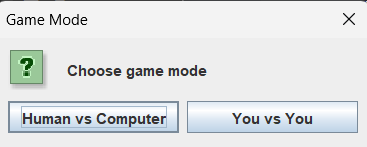

# Ks-Chess
This was my final project for Gaming course. I used maven structure to structure my files. 

## Language used
- Java (Swing)

## How to use maven 
- Download apache maven: 'https://maven.apache.org/download.cgi'
- To build a package: 'mvn package' or 'mvn -f "C:\classpath\pom.xml" package'
- If you make any changes, the package has to be cleaned and rebuilt: 
'mvn clean package' or 'mvn -f "C:\classpath\pom.xml" clean package

## How it will look!
- In the beginning:

# ENJOY!!
